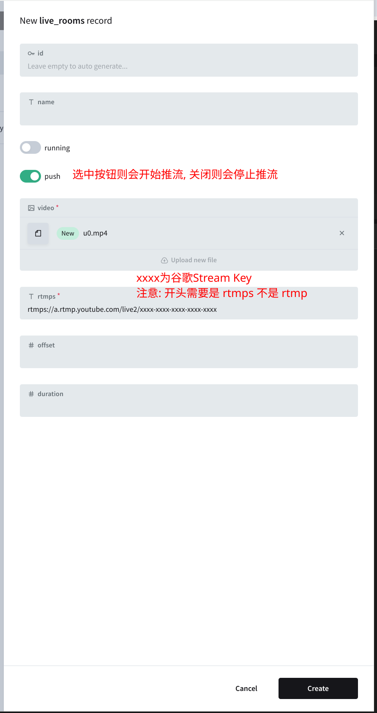

## 简介

将一个视频无限循环推流到直播间中

## 使用

1. 启动服务

```sh
docker run -d --restart always --name video2live -v $PWD/video2live/:/app/pb_data/ -p 8090:8090 shynome/video2live:v0.0.2
```

2. 访问 `http://127.0.0.1:8090/`, 设置好帐号密码, 新建 `live_rooms` 即可开始推流
   

## 注意点

- rtmps 服务器地址 `rtmps://a.rtmp.youtube.com/live2/xxxx-xxxx-xxxx-xxxx-xxxx`,
  **注意:** youtube 的推流地址必须为 `rtmps`, 不能是默认的 `rtmp`, 不然会推流失败
- `running` 状态不如 `offset` 准确, 如果程序正常运行, `offset` 每秒会 +1
- `push` 指示是否要推流, 开启则推流, 关闭则停止推流

## 优点

- 重启后可以接着上次播放进度继续推流(主动停止则会从头推流)
